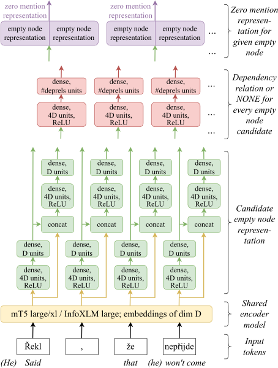
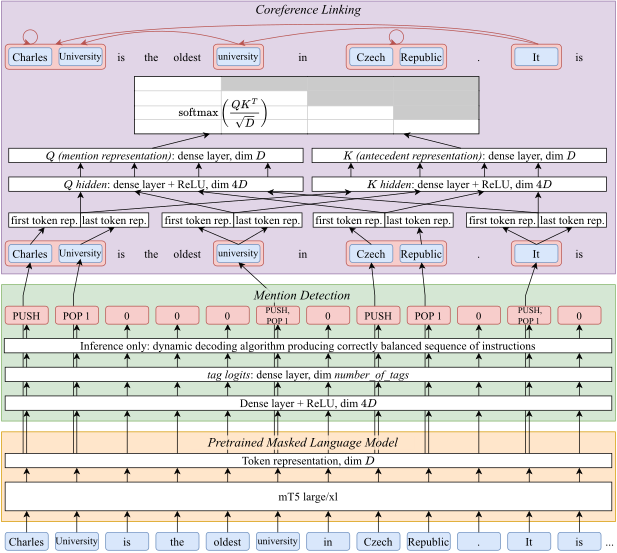

# CorPipe 24: CRAC 2024 Winning System for Multilingual Coreference Resolution

This repository contains the source code of CorPipe 24, which is available under
the MPL-2.0 license. The architecture of CorPipe 24 is described in the following
paper:

---




<h3 align="center"><a href="https://arxiv.org/abs/2410.02756">CorPipe at CRAC 2024: Predicting Zero Mentions from Raw Text</a></h3>

<p align="center">
  <b>Milan Straka</b><br>
  Charles University<br>
  Faculty of Mathematics and Physics<br>
  Institute of Formal and Applied Lingustics<br>
  Malostranské nám. 25, Prague, Czech Republic
</p>

**Abstract:** We present CorPipe 24, the winning entry to the CRAC 2024 Shared
Task on Multilingual Coreference Resolution. In this third iteration of the
shared task, a novel objective is to also predict empty nodes needed for zero
coreference mentions (while the empty nodes were given on input in previous
years). This way, coreference resolution can be performed on raw text. We
evaluate two model variants: a two-stage approach (where the empty nodes are
predicted first using a pretrained encoder model and then processed together
with sentence words by another pretrained model) and a single-stage approach
(where a single pretrained encoder model generates empty nodes, coreference
mentions, and coreference links jointly). In both settings, CorPipe surpasses
other participants by a large margin of 3.9 and 2.8 percent points,
respectively. <br clear="both">

---

## Content of this Repository

- The directory `data` is for the CorefUD 1.2 data, and the preprocessed
  and tokenized version needed for training.
  - The script `data/get.sh` downloads and extracts the CorefUD 1.2 training and
    development data, plus the unannotated test data of the CRAC 2024 shared
    task.

- The `corpipe24.py` is the complete CorPipe 24 source file.

- The `corefud-score.sh` is an evaluation script used by `corpipe24.py`, which
  - performs evaluation (using the official evaluation script from the `corefud-scorer` submodule),
  - optionally (when `-v` is passed), it also:
    - runs validation (using the official UD validator from the `validator` submodule) on the output data,
    - performs evaluation with singletons,
    - performs evaluation with exact match.

- The `res.py` is our script for visualizing performance of running and finished
  experiments, and for comparing two experiments. It was developed for our needs
  and we provide it as-is without documentation.

## The Released `corpipe24-corefud1.2-240906` Model

The `corpipe24-corefud1.2-240906` is a `mT5-large`-based multilingual model.
It is released on https://hdl.handle.net/11234/1-5672 under the CC BY-NC-SA 4.0 license.

The model is language agnostic (no _corpus id_ on input), so it can be in theory
used to predict coreference in any `mT5` language.

This model jointly predicts also the empty nodes needed for zero coreference.
The paper introducing this model also presents an alternative two-stage approach
first predicting empty nodes (via
https://www.kaggle.com/models/ufal-mff/crac2024_zero_nodes_baseline/) and then
performing coreference resolution (via https://hdl.handle.net/11234/1-5673),
which is circa twice as slow but slightly better.

See the [corpipe24-corefud1.2-240906 directory](corpipe24-corefud1.2-240906/) for
more information.

## Training a Single Multilingual `mT5-large`-based CorPipe 24 Model

To train a single multilingual model on all the data using `mT5 large`, you should
1. run the `data/get.sh` script to download the CorefUD 1.2 data,
2. create a Python environments with the packages listed in `requirements.txt`,
3. train the model itself using the `corpipe24.py` script.

   For training a mT5-large variant with square-root mix ratios and without corpus ids, use
   ```sh
    tb="ca_ancora cs_pcedt cs_pdt cu_proiel de_parcorfull de_potsdamcc en_gum en_litbank en_parcorfull es_ancora fr_democrat grc_proiel hbo_ptnk hu_korkor hu_szegedkoref lt_lcc no_bokmaalnarc no_nynorsknarc pl_pcc ru_rucor tr_itcc"
    ratios_sqrt="7.3 12.3 10.3 2.8 1.2 2.1 5.2 5.2 1.2 7.7 6.1 3.0 1.1 1.8 4.0 2.2 5.7 5.3 8.4 4.5 2.7"

    corpipe24.py --train --dev --treebanks $(for c in $tb; do echo data/$c/$c-corefud-train.conllu; done) --resample 10000 $ratios_sqrt --epochs=15 --batch_size=8 --adafactor --learning_rate=6e-4 --learning_rate_decay --encoder=google/mt5-large --segment=512 --right=50 --label_smoothing=0.2 --exp=corpipe24-corefud1.2
   ```

## Predicting with a CorPipe 24 Model

To predict with a trained model, use the following arguments:
```sh
corpipe24.py --load model_checkpoint_path --exp target_directory --epoch 0 --test input1.conllu input2.conllu
```
- the direcotry with the model checkpoint must contain also the `options.json` and `tags.txt` files;
- the outputs are generated in the target directory, with `.00.conllu` suffix;
- if you want to also evaluate the predicted files, you can use `--dev` option instead of `--test`;
- optionally, you can pass `--segment 2560` to specify longer context size, which very likely produces
  better results, but needs more GPU memory.

## How to Cite

During the initial release, only the preprint was available; please cite the
CRAC 2024 paper once published.

```
@misc{straka-2024-corpipe,
  title={{CorPipe at CRAC 2024: Predicting Zero Mentions from Raw Text}},
  author={Milan Straka},
  year={2024},
  eprint={2410.02756},
  archivePrefix={arXiv},
  primaryClass={cs.CL},
  url={https://arxiv.org/abs/2410.02756},
}
```
